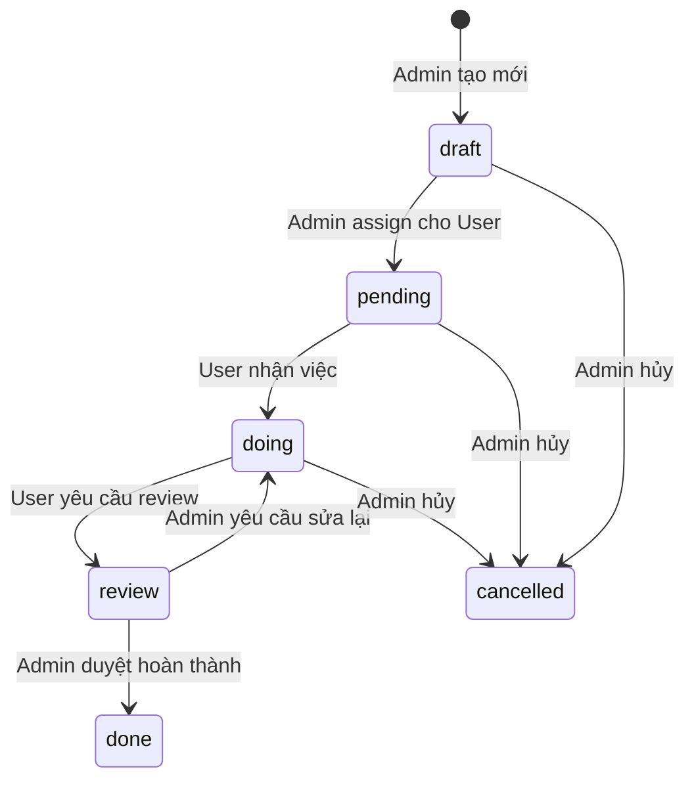

# Phân Tích & Thiết Kế Mở Rộng Module Workman

## 1. Tổng Quan Hiện Trạng

### 1.1 Mô tả Module
Module **Workman** là một module quản lý công việc (task management) đơn giản trên nền tảng NukeViet 5.x. Module này cho phép tạo, sửa, xóa và theo dõi các công việc với các thuộc tính như tiêu đề, mô tả, trạng thái, độ ưu tiên và hạn chót.

### 1.2 Cấu Trúc Hiện Tại

```
modules/workman/
├── admin/
│   ├── main.php       # Trang danh sách công việc (Admin)
│   ├── add.php        # Form thêm/sửa công việc (Admin)
│   └── index.html
├── funcs/
│   ├── main.php       # Trang hiển thị công việc (Frontend - chưa hoàn thiện)
│   └── index.html
├── language/
│   ├── vi.php         # Ngôn ngữ tiếng Việt
│   ├── en.php         # Ngôn ngữ tiếng Anh
│   └── index.html
├── action_mysql.php   # Schema database
├── admin.functions.php
├── admin.menu.php
├── functions.php
├── theme.php
└── version.php
```

### 1.3 Database Schema Hiện Tại

| Column | Type | Description |
|--------|------|-------------|
| `id` | int(11) UNSIGNED | Primary Key, Auto Increment |
| `title` | varchar(250) | Tiêu đề công việc |
| `description` | mediumtext | Mô tả chi tiết |
| `status` | varchar(50) | Trạng thái: `doing`, `done` |
| `priority` | varchar(50) | Độ ưu tiên: `normal`, `urgent` |
| `due_date` | varchar(20) | Ngày hết hạn |

**Vấn đề hiện tại:**
- Chưa có trường `attachment` trong schema (nhưng code đã xử lý)
- Chưa có phân quyền user/admin
- Chưa có trường theo dõi ai tạo, ai được gán công việc

---

## 2. Phân Tích Chức Năng Theo Role

### 2.1 Role: Admin

**Chức năng hiện có:**
- ✅ Xem danh sách tất cả công việc (với phân trang)
- ✅ Thêm mới công việc
- ✅ Sửa công việc
- ✅ Xóa công việc
- ✅ Upload file/ảnh đính kèm

**Chức năng cần bổ sung:**
- ❌ Gán công việc cho user
- ❌ Xem công việc theo user
- ❌ Thống kê tổng quan
- ❌ Quản lý danh mục công việc
- ❌ Xuất báo cáo

### 2.2 Role: User

**Chức năng hiện có:**
- ⚠️ Frontend chỉ có hardcoded data (chưa lấy từ DB)

**Chức năng cần bổ sung:**
- ❌ Xem danh sách công việc được giao
- ❌ Cập nhật trạng thái công việc của mình
- ❌ Thêm comment/ghi chú
- ❌ Upload file hoàn thành
- ❌ Nhận thông báo khi có công việc mới

---

## 3. Thiết Kế Mở Rộng Database

### 3.1 Bảng chính: `{prefix}_workman` (Cập nhật)

```sql
CREATE TABLE {prefix}_workman (
    `id` int(11) UNSIGNED NOT NULL AUTO_INCREMENT,
    `title` varchar(250) NOT NULL,
    `description` mediumtext,
    `status` varchar(50) DEFAULT 'pending',
    `priority` varchar(50) DEFAULT 'normal',
    `due_date` int(11) DEFAULT 0,
    `attachment` varchar(255) DEFAULT '',
    
    -- Mới: Phân quyền và theo dõi
    `created_by` int(11) UNSIGNED DEFAULT 0,
    `assigned_to` int(11) UNSIGNED DEFAULT 0,
    `category_id` int(11) UNSIGNED DEFAULT 0,
    `created_at` int(11) DEFAULT 0,
    `updated_at` int(11) DEFAULT 0,
    `completed_at` int(11) DEFAULT 0,
    
    PRIMARY KEY (`id`),
    KEY `idx_status` (`status`),
    KEY `idx_assigned_to` (`assigned_to`),
    KEY `idx_created_by` (`created_by`),
    KEY `idx_category` (`category_id`)
) ENGINE=InnoDB DEFAULT CHARSET=utf8mb4;
```

### 3.2 Bảng mới: `{prefix}_workman_categories`

```sql
CREATE TABLE {prefix}_workman_categories (
    `id` int(11) UNSIGNED NOT NULL AUTO_INCREMENT,
    `title` varchar(150) NOT NULL,
    `description` varchar(255) DEFAULT '',
    `color` varchar(7) DEFAULT '#3498db',
    `weight` int(11) DEFAULT 0,
    `status` tinyint(1) DEFAULT 1,
    PRIMARY KEY (`id`)
) ENGINE=InnoDB DEFAULT CHARSET=utf8mb4;
```

### 3.3 Bảng mới: `{prefix}_workman_comments`

```sql
CREATE TABLE {prefix}_workman_comments (
    `id` int(11) UNSIGNED NOT NULL AUTO_INCREMENT,
    `work_id` int(11) UNSIGNED NOT NULL,
    `user_id` int(11) UNSIGNED NOT NULL,
    `content` text NOT NULL,
    `attachment` varchar(255) DEFAULT '',
    `created_at` int(11) DEFAULT 0,
    PRIMARY KEY (`id`),
    KEY `idx_work_id` (`work_id`)
) ENGINE=InnoDB DEFAULT CHARSET=utf8mb4;
```

### 3.4 Bảng mới: `{prefix}_workman_logs`

```sql
CREATE TABLE {prefix}_workman_logs (
    `id` int(11) UNSIGNED NOT NULL AUTO_INCREMENT,
    `work_id` int(11) UNSIGNED NOT NULL,
    `user_id` int(11) UNSIGNED NOT NULL,
    `action` varchar(50) NOT NULL,
    `old_value` varchar(255) DEFAULT '',
    `new_value` varchar(255) DEFAULT '',
    `created_at` int(11) DEFAULT 0,
    PRIMARY KEY (`id`),
    KEY `idx_work_id` (`work_id`)
) ENGINE=InnoDB DEFAULT CHARSET=utf8mb4;
```

### 3.5 Bảng mới: `{prefix}_workman_notifications`

```sql
CREATE TABLE {prefix}_workman_notifications (
    `id` int(11) UNSIGNED NOT NULL AUTO_INCREMENT,
    `user_id` int(11) UNSIGNED NOT NULL,
    `work_id` int(11) UNSIGNED NOT NULL,
    `type` varchar(50) NOT NULL COMMENT 'assigned, status_changed, commented, deadline_reminder',
    `message` varchar(255) NOT NULL,
    `is_read` tinyint(1) DEFAULT 0,
    `created_at` int(11) DEFAULT 0,
    PRIMARY KEY (`id`),
    KEY `idx_user_id` (`user_id`),
    KEY `idx_work_id` (`work_id`),
    FOREIGN KEY (`user_id`) REFERENCES `{prefix}_users`(`userid`) ON DELETE CASCADE,
    FOREIGN KEY (`work_id`) REFERENCES `{prefix}_workman`(`id`) ON DELETE CASCADE
) ENGINE=InnoDB DEFAULT CHARSET=utf8mb4;
```

### 3.6 Foreign Key Constraints (Cập nhật các bảng)

> [!IMPORTANT]
> Cần bổ sung FK constraints để đảm bảo data integrity.

**Bảng `{prefix}_workman`:**
```sql
ALTER TABLE {prefix}_workman
ADD COLUMN `is_deleted` tinyint(1) DEFAULT 0,
ADD COLUMN `deleted_at` int(11) DEFAULT NULL,
ADD FOREIGN KEY (`category_id`) REFERENCES `{prefix}_workman_categories`(`id`) ON DELETE SET NULL;
```

**Bảng `{prefix}_workman_comments`:**
```sql
ALTER TABLE {prefix}_workman_comments
ADD FOREIGN KEY (`work_id`) REFERENCES `{prefix}_workman`(`id`) ON DELETE CASCADE,
ADD FOREIGN KEY (`user_id`) REFERENCES `{prefix}_users`(`userid`) ON DELETE CASCADE;
```

**Bảng `{prefix}_workman_logs`:**
```sql
ALTER TABLE {prefix}_workman_logs
ADD FOREIGN KEY (`work_id`) REFERENCES `{prefix}_workman`(`id`) ON DELETE CASCADE,
ADD FOREIGN KEY (`user_id`) REFERENCES `{prefix}_users`(`userid`) ON DELETE SET NULL;
```

### 3.7 Validation Rules

| Trường | Validation |
|--------|------------|
| `title` | Required, 5-250 ký tự, không chứa ký tự đặc biệt nguy hiểm |
| `description` | Optional, max 65535 ký tự |
| `status` | Enum: `draft`, `pending`, `doing`, `review`, `done`, `cancelled` |
| `priority` | Enum: `low`, `normal`, `high`, `urgent` |
| `due_date` | Unix timestamp, >= current time khi tạo mới |
| `attachment` | File types: jpg, png, gif, pdf, doc, docx, xls, xlsx. Max: 5MB |

---

## 4. Thiết Kế Chức Năng Mở Rộng

### 4.1 Admin Panel

#### 4.1.1 Cấu trúc file mới

```
modules/workman/admin/
├── main.php           # Danh sách công việc (cập nhật)
├── add.php            # Thêm/sửa công việc (cập nhật)
├── categories.php     # [NEW] Quản lý danh mục
├── users.php          # [NEW] Xem công việc theo user
├── reports.php        # [NEW] Thống kê & báo cáo
└── settings.php       # [NEW] Cài đặt module
```

#### 4.1.2 Trang Admin - Danh sách công việc (Cập nhật)

| Chức năng | Mô tả |
|-----------|-------|
| Filter theo user | Lọc công việc theo người được giao |
| Filter theo category | Lọc theo danh mục |
| Filter theo status | Lọc theo trạng thái (pending/doing/done/cancelled) |
| Bulk actions | Xóa nhiều, thay đổi status nhiều task |
| Quick assign | Gán nhanh user cho công việc |

---

### 4.2 User Panel (Frontend)

#### 4.2.1 Cấu trúc file mới

```
modules/workman/funcs/
├── main.php           # [UPDATE] Dashboard user
├── list.php           # [NEW] Danh sách công việc của user
├── detail.php         # [NEW] Chi tiết công việc
├── update.php         # [NEW] Cập nhật trạng thái
└── comment.php        # [NEW] Thêm comment
```

#### 4.2.2 Theme files mới

```
themes/default/modules/workman/
├── main.tpl           # Dashboard
├── list.tpl           # Danh sách công việc
├── detail.tpl         # Chi tiết công việc
├── comment_form.tpl   # Form comment
└── blocks/
    ├── my_tasks.tpl   # Block hiển thị task của user
    └── urgent.tpl     # Block hiển thị task khẩn cấp
```

---

## 5. Workflow Trạng Thái

> [!IMPORTANT]
> Workflow đã được cập nhật với trạng thái `draft` để xử lý case Admin tạo task nhưng chưa assign.



**Các trạng thái:**

| Status | Mô tả | Chuyển từ | Chuyển bởi |
|--------|-------|-----------|------------|
| `draft` | Bản nháp (chưa assign) | Tạo mới | Admin |
| `pending` | Đã assign, chờ User nhận | `draft` | Admin |
| `doing` | Đang thực hiện | `pending`, `review` | User nhận / Admin yêu cầu sửa |
| `review` | Chờ Admin duyệt | `doing` | User |
| `done` | Hoàn thành | `review` | Admin |
| `cancelled` | Đã hủy | `draft`, `pending`, `doing` | Admin |

**Logic xử lý:**
1. Admin tạo task → `draft` (task chưa hiển thị cho User)
2. Admin assign → `pending` (User thấy trong danh sách "Công việc mới")
3. User click "Nhận việc" → `doing`
4. User hoàn thành, click "Yêu cầu review" → `review`
5. Admin duyệt → `done` hoặc yêu cầu sửa → `doing`

---

## 6. Phân Quyền Chi Tiết

### 6.1 Admin Permissions

| Quyền | Mô tả |
|-------|-------|
| `workman_view_all` | Xem tất cả công việc |
| `workman_add` | Thêm công việc mới |
| `workman_edit` | Sửa công việc |
| `workman_delete` | Xóa công việc |
| `workman_assign` | Gán công việc cho user |
| `workman_manage_cats` | Quản lý danh mục |
| `workman_reports` | Xem thống kê báo cáo |

### 6.2 User Permissions

| Quyền | Mô tả |
|-------|-------|
| `workman_view_own` | Xem công việc được giao |
| `workman_update_status` | Cập nhật trạng thái |
| `workman_comment` | Thêm comment |
| `workman_upload` | Upload file hoàn thành |

---

## 7. Kế Hoạch Triển Khai

### Phase 1: Database & Core (1-2 ngày)
- [ ] Cập nhật `action_mysql.php` với schema mới
- [ ] Tạo migration script cho data cũ
- [ ] Cập nhật model/functions.php

### Phase 2: Admin Functions (2-3 ngày)
- [ ] Cập nhật `admin/main.php` với filter, assign
- [ ] Cập nhật `admin/add.php` với category, assign
- [ ] Tạo `admin/categories.php`
- [ ] Tạo `admin/reports.php`

### Phase 3: User Functions (2-3 ngày)
- [ ] Tạo `funcs/main.php` (dashboard)
- [ ] Tạo `funcs/list.php`
- [ ] Tạo `funcs/detail.php`
- [ ] Tạo `funcs/update.php`
- [ ] Tạo `funcs/comment.php`

### Phase 4: Templates & UI (2 ngày)
- [ ] Cập nhật admin templates
- [ ] Tạo frontend templates
- [ ] Responsive design
- [ ] JavaScript interactions

### Phase 5: Testing & Docs (1 ngày)
- [ ] Test đầy đủ các chức năng
- [ ] Viết documentation
- [ ] Hướng dẫn sử dụng
